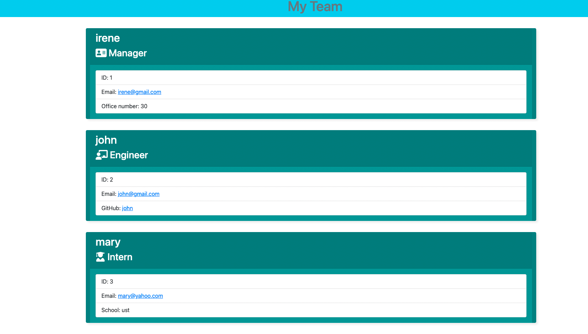

## Project Title: 
<h1 align="center">Team-Info Generator  </h1>
## Description
🔍 It builds a html page for team-info based on userinput

## Table of Contents
- [Description](#description)
- [Installation](#installation)
- [Usage](#usage)
- [License](#license)
- [Contributing](#contributing)
- [Tests](#tests)
- [Questions](#questions)

## Installation
💾  Download or Clone File then npm install inquirer and jest
    

## Usage
💻  after download and install , answer the questions and it will automatically generate html file for your team member 

https://user-images.githubusercontent.com/92761848/150701188-d9321ad8-cfbe-4cc0-8f10-89ea1b307da8.mp4

Built with:

- HTML
- CSS
- Bootstrap 
- Javascript
- Node 

## Credits 
👪 Made by Irene with the help TA's, instructor @Trilogy,  nicolewallace09, JamesL_Jenks and GOOGLE. 

## Tests
✏️ npm run test

